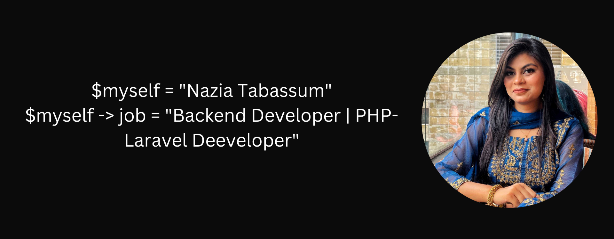
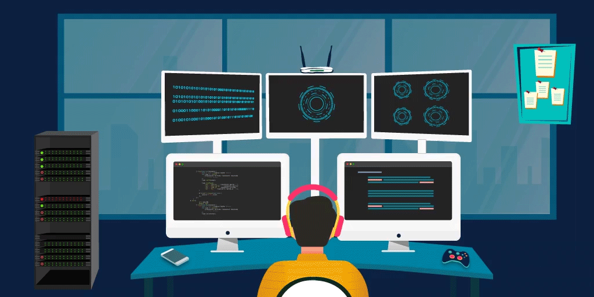

  
### Web Developer || Software Engineer || PHP-Laravel Developer
<h2>Hey there! I'm Nazia</h2>

<!-- ## 👋 &nbsp;Hey there! I'm Aditya -->

### 👨🏻‍💻 &nbsp;About Me

💡 &nbsp;I completed Bachelor's Science of Computer Engineering at University of Asia Pacific.\
🎓 &nbsp;I love to develop websites and learn new technologies.\
🌱 &nbsp;I'm on track for learning more about Performance Optimization:, DevOps and Deployment, Monitoring-Logging and Cloud Architecture.\
✍️ &nbsp;In my free time, I try to practice designing and enrich my communication skill.\
💬 &nbsp;Feel free to reach out to me for pro bono consulting and volunteering, or just for some interesting discussion.\
✉️ &nbsp;You can shoot me an email at naziatabassum21795@gmail.com! or call me +88 01705200983. I'll try to respond as soon as I can.\
📄 &nbsp;Please have a look at my [Résumé]([https://www.adityavsingh.com/resume.html](https://docs.google.com/document/d/1gIvInGxb6v7TrSSlr0e3W8b9o7lIUg0sHA22XQVUp_w/edit?usp=sharing)) for more details about me. I'm open to feedback and suggestions!

### 🛠 &nbsp;Tech Stack

<!-- &nbsp; -->
&nbsp;
&nbsp;
&nbsp;
&nbsp;
<!-- \ -->
&nbsp;
&nbsp;
&nbsp;
&nbsp;
&nbsp;
<!-- &nbsp; -->
\

&nbsp;
&nbsp;
&nbsp;
&nbsp;
\
&nbsp;
&nbsp;
<!-- &nbsp; -->
<!-- \ -->

### ⚙️ &nbsp;GitHub Analytics

### 🤝🏻 &nbsp;Connect with Me

 

